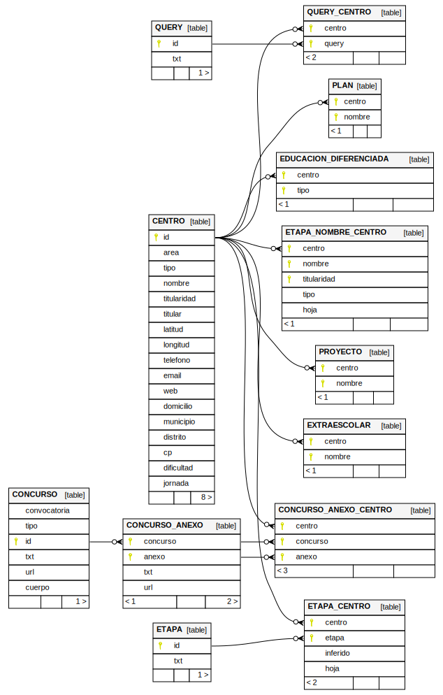

Crea una base de datos `sqlite` a partir del:

* [Buscador de centros](https://gestiona.comunidad.madrid/wpad_pub/run/j/BusquedaAvanzada.icm)
* [Portal de datos abiertos](https://datos.comunidad.madrid/catalogo/dataset/centros_educativos/resource/9578660d-f9de-48f4-a387-7f1a8333338b)
* [Concurso de traslados de Maestros 2024-2025](https://www.comunidad.madrid/servicios/educacion/concurso-traslados-maestros)
* [Concurso de traslados de Profesores de Secundaria, Formación Profesional y Régimen Especial 2024-2025](https://www.comunidad.madrid/servicios/educacion/concurso-traslados-profesores-secundaria-formacion-profesional-regimen-especial)
* [Maestros: Asignación de destinos provisionales en inicio de curso (2024-2025)](https://www.comunidad.madrid/servicios/educacion/maestros-asignacion-destinos-provisionales-inicio-curso)
* [Secundaria, FP y RE: Asignación de destinos provisionales en inicio de curso (2024-2025)](https://www.comunidad.madrid/servicios/educacion/secundaria-fp-re-asignacion-destinos-provisionales-inicio-curso)

El resultado actual se puede consular en [`db.sql`](out/db.sql).

# FAQ

## ¿Cómo se garantiza la calidad de los datos recuperados del [buscador de centros](https://gestiona.comunidad.madrid/wpad_pub/run/j/BusquedaAvanzada.icm)?

El [buscador de centros](https://gestiona.comunidad.madrid/wpad_pub/run/j/BusquedaAvanzada.icm)
es bastante inestable, ya que en ocasiones dos búsquedas idénticas (o dos visitas a la misma
ficha de centro) dan resultados diferentes.

Para lidiar con este problema, toda consulta al
[buscador de centros](https://gestiona.comunidad.madrid/wpad_pub/run/j/BusquedaAvanzada.icm)
se realiza varias veces hasta que devuelva dos veces o más el mismo resultado,
siendo este (el resultado devuelto más veces) el que se almacena en la base de datos.

## ¿Qué es la tabla `QUERY`?

Una `QUERY` es un filtro que se puede hacer en [el buscador de centros](https://gestiona.comunidad.madrid/wpad_pub/run/j/BusquedaAvanzada.icm), y la tabla `QUERY_CENTRO` recoge los centros que aparecen como resultado al hacer esa `query`.

## ¿Qué diferencia hay entre la tabla `ETAPA` y `ETAPA_NOMBRE_CENTRO`?

La diferencia entre `ETAPA` y `ETAPA_NOMBRE_CENTRO` deriva de que en [el buscador de centros](https://gestiona.comunidad.madrid/wpad_pub/run/j/BusquedaAvanzada.icm) hay dos maneras (no siempre coincidentes) de obtener las etapas educativas de un centro.

La 1º es seleccionar una etapa educativa y darle a buscar, lo cual presuntamente nos dará como resultados los centros que ofertan esa etapa educativa.

La 2º es entrar en la ficha de un centro y ver en su descripción las etapas educativas que oferta.

La 1º información es la recogida en la tabla `ETAPA` y `ETAPA_CENTRO`.

La 2º información es la recogida en la tabla `ETAPA_NOMBRE_CENTRO`.

Como ya se ha dicho, ambos caminos no siempre dan el mismo resultado. Además, en las fichas aparecen nombres de etapas educativas que no coinciden con las que puedes seleccionar en el buscador.

## ¿Qué es el campo `inferido` de la tabla `ETAPA_CENTRO`?

El buscador muestra la información de las etapas educativas como un árbol de jerarquía, por ejemplo `Educación Personas Adultas -> Educación Secundaria Obligatoria para personas adultas (LOE-LOMCE) -> A distancia`, y por lo tanto sería de presuponer que si un centro `X` aparece buscando por ese filtro también debería aparecer si busco por `Educación Personas Adultas -> Educación Secundaria Obligatoria para personas adultas (LOE-LOMCE)` (pues este filtro es más general que el anterior) pero no siempre es así.

Por lo tanto, `inferido=1` significa que el buscador no dice explícitamente que el centro tiene esa etapa educativa, pero se sobreentiende que si porque tiene alguna de sus componentes.